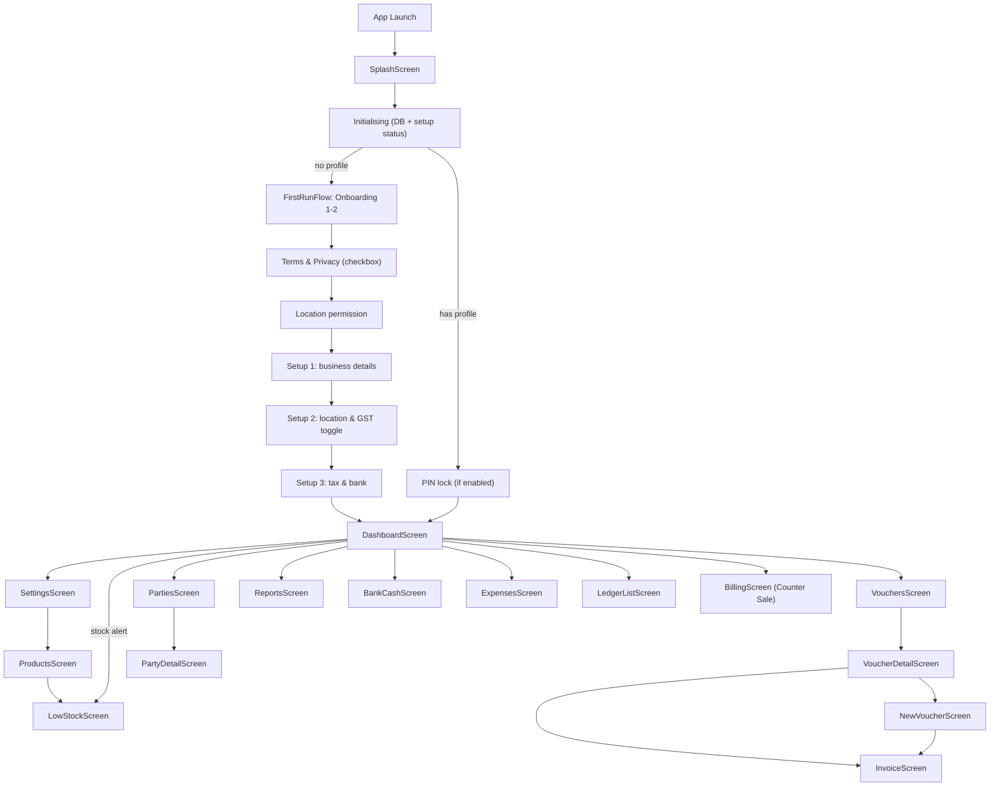

# SCREENS.md — Mavo

> Last updated: 2026-10-05

## Navigation structure

```
App Launch
  ├─ SplashScreen (Zero brand splash: dark icon tile + "Mavo" wordmark)
  ├─ Initialising (dark logo tile, "INITIALIZING", thin progress bar)
  ├─ (no profile) → FirstRunFlow wizard
  │     Onboarding 1 → Onboarding 2 (pager dots, pill Next)
  │       → Terms & Privacy page (checkbox + document rows) → Location permission
  │       → Setup 1 "Basic details" → Setup 2 "Where you are" → Setup 3 "Tax & bank"
  │       → Dashboard
  └─ (has profile) → PIN (if enabled) → Dashboard
```

The wizard is not a NavHost route: it is the same `when` gate in `MainActivity.kt`
that used to show `SetupScreen`, so system Back only walks wizard steps.

### Bottom navigation bar (4 tabs)

| Tab | Route | Screen | Icon |
|-----|-------|--------|------|
| Home | `dashboard` | DashboardScreen | Home |
| Vouchers | `vouchers` | VouchersScreen | Assignment |
| Parties | `parties` | PartiesScreen | Group |
| Settings | `settings` | SettingsScreen | Settings |

### Full screen map

| Screen file | Route | Purpose | Entry from | Exit to |
|-------------|-------|---------|------------|---------|
| `SplashScreen.kt` | (initial) | Zero brand splash: dark rounded icon tile + "Mavo" wordmark on light bg | App launch | Initialising, Setup or Dashboard |
| `MainActivity.kt` (`MainAppEntry` / `AppContent`) | (initial) | Initialising screens: Zero logo tile + "INITIALIZING" progress bar, DB error/retry | App launch | Wizard, PIN or Dashboard |
| `FirstRunFlow.kt` | (initial, no profile) | First-run wizard: step order, Back handling, shared `SetupDraft`; two onboarding pages, Terms & Privacy page, permission step (all Zero restyle) | Splash (no profile) | Dashboard (after profile save) |
| `SetupScreen.kt` | (wizard steps 1–3) | Setup 1 "Basic details", Setup 2 "Where you are", Setup 3 "Tax & bank"; Zero header (circle back + "Step N of 3"), 3-segment progress, pill CTA | FirstRunFlow | FirstRunFlow → Dashboard |
| `DashboardScreen.kt` | `dashboard` | KPIs, quick actions, business overview | Bottom tab | Any feature screen |
| `VouchersScreen.kt` | `vouchers` | List all vouchers with status/type chips, filters, search; black multi-select bar (Select all, CSV Export, Delete); delete confirm bottom sheet with ledger stats | Bottom tab | VoucherDetail, NewVoucher |
| `PartiesScreen.kt` | `parties` | List customers/suppliers, CRUD | Bottom tab | PartyDetail |
| `PartySheets.kt` | (bottom sheet in Parties) | Add/edit party form | PartiesScreen | PartiesScreen |
| `SettingsScreen.kt` | `settings` | Zero-style grouped menu (Profile & master data / Appearance / Financial / Data); inline sub-screens: business profile, theme, dashboard options, FY, data management, audit log, about | Bottom tab | Sub-sections inline |
| `ProductsScreen.kt` | `products` | Product catalog, CRUD, stock info; Zero "New Product / Edit Product" full-screen entry (WizardHeader + pinned Cancel / Save bar) | Settings → Products | LowStock, back |
| `ReportsScreen.kt` | `reports` | Business & financial reports | Dashboard quick action | Back to Dashboard |
| `StockReportScreen.kt` | (inline in Reports, NewVoucher stock sheet) | Stock Summary: SKU / stock value / low-out stat cards, search toggle, All/Low/Out chips, status pills, CSV export | ReportsScreen, NewVoucher | ReportsScreen |
| `LowStockScreen.kt` | `lowstock` | "Inventory alerts": Low & Out of Stock list with Reorder pills; Dismiss / Create purchase order → Purchase voucher | Products banner, Dashboard stock alert | NewVoucher, back |
| `HsnSearchDialog.kt` | (dialog overlay) | Search HSN/SAC: keyword search, tappable results, Use-code confirm | Products editor, Quick-add product | Caller screen |
| `BankCashScreen.kt` | `bank_cash` | Cash & bank transactions | Dashboard quick action | Back to Dashboard |
| `ExpensesScreen.kt` | `expenses` | Expense logging and list | Dashboard quick action | Back to Dashboard |
| `IncomeScreen.kt` | (inline) | Income logging and list | Dashboard quick action | Back to Dashboard |
| `LedgerListScreen.kt` | `ledger_books` | Browse ledger accounts and entries | Dashboard quick action | Back to Dashboard |
| `BillingScreen.kt` | `counter_sale` | Responsive counter sale flow; stacked on compact windows and split-pane on expanded windows | Dashboard quick action | Back to Dashboard |
| `NewVoucherScreen` | `new_voucher?voucherId={id}` | Create voucher of any type via the 3-step wizard (Details → Items → Review) on phones; edit mode is a single page labelled "EDITING" in the header | VoucherDetail, VouchersScreen, Dashboard | Invoice, back |
| `VoucherItemSheet.kt` | (bottom sheet in NewVoucher) | Add/edit line item on a voucher | NewVoucherScreen | NewVoucherScreen |
| `VoucherDetailScreen.kt` | `voucher_detail/{voucherId}` | Voucher summary: totals, line items, status pill, Edit / Share / PDF / Print bar, overflow Delete | VouchersScreen (row tap) | NewVoucher, InvoiceScreen, back |
| `VoucherDeleteSheet.kt` | (bottom sheet) | Delete confirm: voucher count, ledger entries reversed, total value, Cancel / Delete | VouchersScreen, VoucherDetailScreen | Caller screen |
| `InvoiceScreen.kt` | `invoice/{voucherId}` | View generated invoice, share/print | NewVoucher (after save), VoucherDetail | Back to Vouchers |
| `PartyDetailScreen` | `party_detail/{partyId}` | Party ledger, transaction history | PartiesScreen | Back to Parties |
| `BarcodeScannerDialog.kt` | (dialog overlay) | Camera barcode/OCR scanning | Products, NewVoucher | Caller screen |
| `BusinessProfileSettingsSection.kt` | (inline in Settings) | "Master data" modal: identity block + all profile fields (ZbField labels) + pinned Cancel / Save profile bar | SettingsScreen | SettingsScreen |
| `DataManagementContent` / `AuditLogContent` | (inline in Settings) | Backup/restore/CSV export-import, DB stats, FY audit events | Settings → Data Management | Settings |
| `EmailAutomationSection.kt` | (inline in Settings) | Email rules, accounts, history | SettingsScreen | SettingsScreen |
| `ProfileFormSupport.kt` | (shared form helpers) | Validation, `SetupStep` order, state auto-detect | First-run wizard, Settings | — |
| `SharedComponents.kt` | (shared) | `RetailTextField`, `StateDropdownMenu`, `WizardScaffold`, PIN lookup | Multiple screens | — |
| `ProductOptionalFields.kt` | (inline in Products) | Batch, serial, secondary unit fields | ProductsScreen | ProductsScreen |

## Navigation flow diagram


