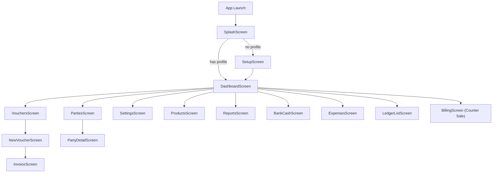

# SCREENS.md — ZeroBook

> Last updated: 2026-09-29

## Navigation structure

```
App Launch
  └─ SplashScreen
       ├─ (no profile) → SetupScreen → Dashboard
       └─ (has profile) → Dashboard
```

### Bottom navigation bar (4 tabs)

| Tab | Route | Screen | Icon |
|-----|-------|--------|------|
| Home | `dashboard` | DashboardScreen | Home |
| Vouchers | `vouchers` | VouchersScreen | Assignment |
| Parties | `parties` | PartiesScreen | Group |
| Settings | `settings` | SettingsScreen | Settings |

### Full screen map

| Screen file | Route | Purpose | Entry from | Exit to |
|-------------|-------|---------|------------|---------|
| `SplashScreen.kt` | (initial) | Brand splash on cold start | App launch | Setup or Dashboard |
| `SetupScreen.kt` | (initial) | First-run business profile entry | Splash (no profile) | Dashboard |
| `DashboardScreen.kt` | `dashboard` | KPIs, quick actions, business overview | Bottom tab | Any feature screen |
| `VouchersScreen.kt` | `vouchers` | List all vouchers, filter by type, create new | Bottom tab | NewVoucher, Invoice |
| `PartiesScreen.kt` | `parties` | List customers/suppliers, CRUD | Bottom tab | PartyDetail |
| `PartySheets.kt` | (bottom sheet in Parties) | Add/edit party form | PartiesScreen | PartiesScreen |
| `SettingsScreen.kt` | `settings` | Business profile, theme, FY, email, export, about | Bottom tab | Sub-sections inline |
| `ProductsScreen.kt` | `products` | Product catalog, CRUD, stock info | Dashboard quick action | Back to Dashboard |
| `ReportsScreen.kt` | `reports` | Business & financial reports | Dashboard quick action | Back to Dashboard |
| `StockReportScreen.kt` | (inline in Reports) | Stock level report | ReportsScreen | ReportsScreen |
| `BankCashScreen.kt` | `bank_cash` | Cash & bank transactions | Dashboard quick action | Back to Dashboard |
| `ExpensesScreen.kt` | `expenses` | Expense logging and list | Dashboard quick action | Back to Dashboard |
| `IncomeScreen.kt` | (inline) | Income logging and list | Dashboard quick action | Back to Dashboard |
| `LedgerListScreen.kt` | `ledger_books` | Browse ledger accounts and entries | Dashboard quick action | Back to Dashboard |
| `BillingScreen.kt` | `counter_sale` | Quick counter sale flow | Dashboard quick action | Back to Dashboard |
| `NewVoucherScreen` | `new_voucher?voucherId={id}` | Create/edit voucher of any type | VouchersScreen, Dashboard | Invoice, back to Vouchers |
| `VoucherItemSheet.kt` | (bottom sheet in NewVoucher) | Add/edit line item on a voucher | NewVoucherScreen | NewVoucherScreen |
| `InvoiceScreen.kt` | `invoice/{voucherId}` | View generated invoice, share/print | NewVoucher (after save) | Back to Vouchers |
| `PartyDetailScreen` | `party_detail/{partyId}` | Party ledger, transaction history | PartiesScreen | Back to Parties |
| `BarcodeScannerDialog.kt` | (dialog overlay) | Camera barcode/OCR scanning | Products, NewVoucher | Caller screen |
| `BusinessProfileSettingsSection.kt` | (inline in Settings) | Edit business profile after setup | SettingsScreen | SettingsScreen |
| `EmailAutomationSection.kt` | (inline in Settings) | Email rules, accounts, history | SettingsScreen | SettingsScreen |
| `ProfileFormSupport.kt` | (shared form helpers) | Validation, state auto-detect | Setup, Settings | — |
| `SharedComponents.kt` | (shared) | Common UI pieces across screens | Multiple screens | — |
| `ProductOptionalFields.kt` | (inline in Products) | Batch, serial, secondary unit fields | ProductsScreen | ProductsScreen |

## Navigation flow diagram


