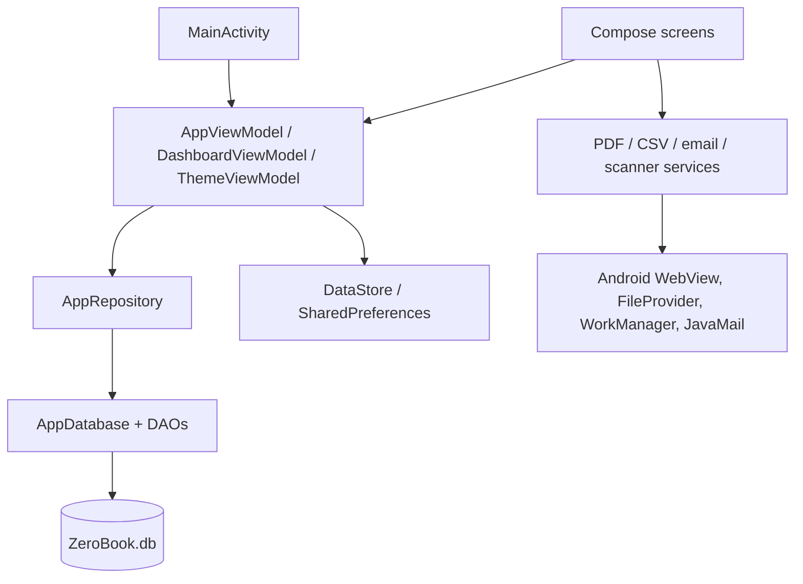

# Dependency Map

**VERIFIED:** dependency edges are based on imports and construction in current source.  
**INFERRED:** diagram represents runtime call direction, not a strict compile-time module boundary.
