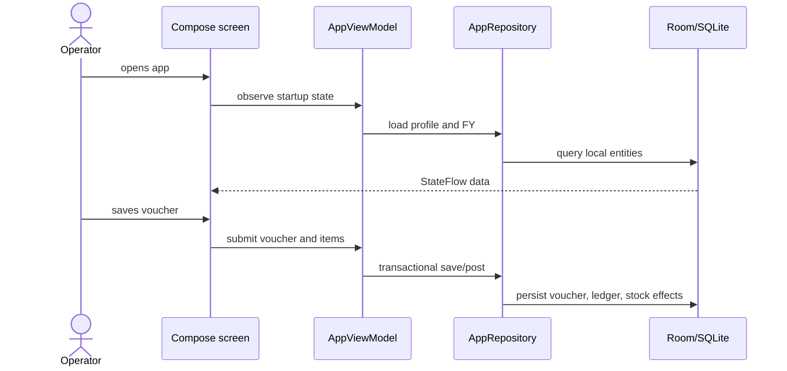

# Workflow Map

## Entry and exit

- Startup enters splash, setup, optional PIN, then dashboard.
- Main destinations are dashboard, vouchers, parties, settings.
- Secondary routes open reports, products, bank/cash, expenses, counter sale, new voucher, invoice, ledger books, and party detail.
- File/PDF/email workflows exit through Android shares, FileProvider URIs, WebView PDF output, SMTP, or WorkManager.
