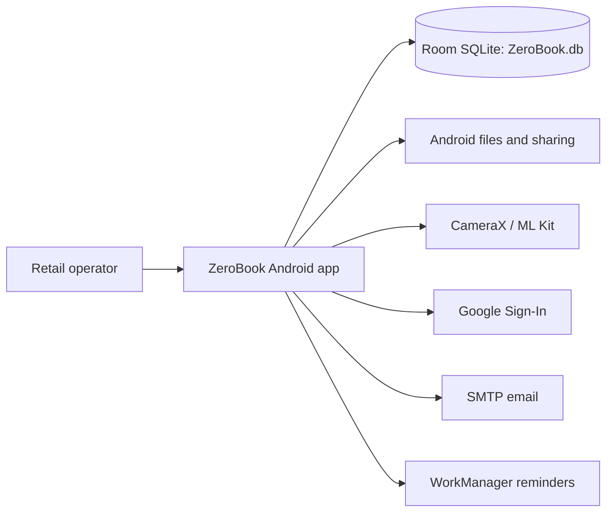

# Architecture Research

## Scope

This is a single Android application module, not a distributed backend. The architecture is a local-first Compose application with a repository-mediated Room database and Android service integrations.

## Containers

1. **Android UI container:** Compose screens, navigation, transitions, theme, dialogs.
2. **Application state container:** activity-scoped ViewModels and screen-local state.
3. **Domain/data container:** Room entities/DAOs, repository, financial-year and accounting operations.
4. **Output/integration container:** PDF/HTML, CSV, FileProvider, camera/ML Kit, email, WorkManager.
5. **SQLite store:** `ZeroBook.db`, schema version 14.

## C4 context

## Migration-sensitive coupling

- `MainActivity` is composition root and route coordinator.
- `AppViewModel` is a broad application service, not a narrow feature ViewModel.
- Room schema and defensive `ensure*` migration functions encode legacy compatibility.
- Android WebView and FileProvider are embedded in document output.
- SMTP/OAuth and encrypted preferences are platform-specific.
- Domain entities mix accounting data, UI defaults, and serialized JSON extensions.
