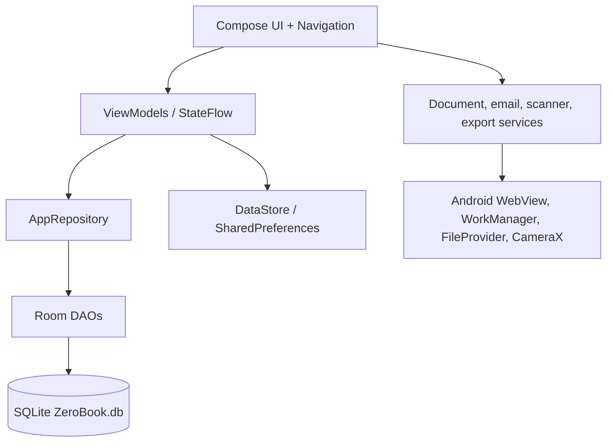

# C4 Container View

```mermaid
flowchart TD
    Compose[Compose UI + Navigation] --> VM[ViewModels / StateFlow]
    VM --> Repo[AppRepository]
    Repo --> Dao[Room DAOs]
    Dao --> DB[(SQLite ZeroBook.db)]
    UIService[Document, email, scanner, export services] --> Platform[Android WebView, WorkManager, FileProvider, CameraX]
    Compose --> UIService
    VM --> Preferences[DataStore / SharedPreferences]
```

Room and preference storage are local. Service calls leave the process only for platform/external email/auth operations.
