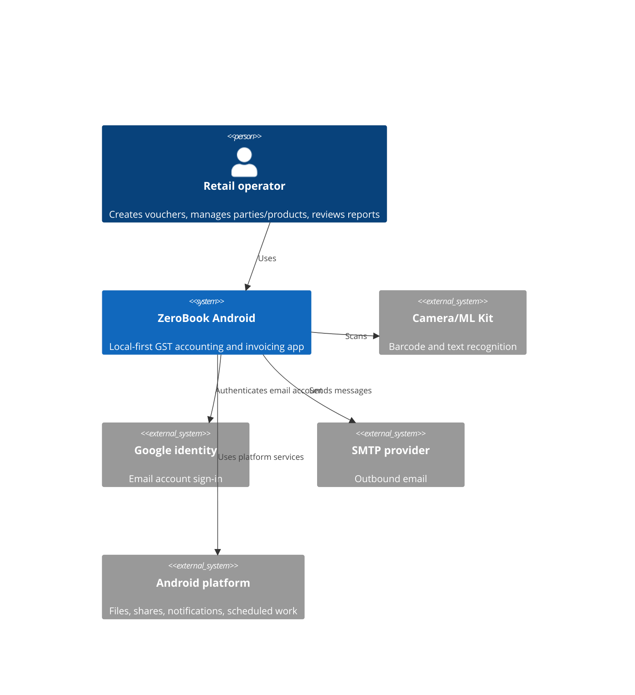

# C4 System Context

```mermaid
C4Context
    Person(operator, "Retail operator", "Creates vouchers, manages parties/products, reviews reports")
    System(app, "ZeroBook Android", "Local-first GST accounting and invoicing app")
    System_Ext(camera, "Camera/ML Kit", "Barcode and text recognition")
    System_Ext(google, "Google identity", "Email account sign-in")
    System_Ext(smtp, "SMTP provider", "Outbound email")
    System_Ext(android, "Android platform", "Files, shares, notifications, scheduled work")
    Rel(operator, app, "Uses")
    Rel(app, camera, "Scans")
    Rel(app, google, "Authenticates email account")
    Rel(app, smtp, "Sends messages")
    Rel(app, android, "Uses platform services")
```

Actors and external systems are conservative. No server API boundary was verified.
