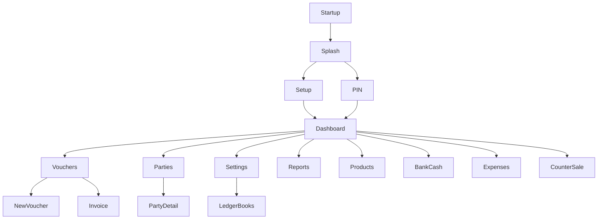

# Navigation Map

```mermaid
flowchart TD
    Startup --> Splash
    Splash --> Setup
    Splash --> PIN
    Setup --> Dashboard
    PIN --> Dashboard
    Dashboard --> Vouchers
    Dashboard --> Parties
    Dashboard --> Settings
    Dashboard --> Reports
    Dashboard --> Products
    Dashboard --> BankCash
    Dashboard --> Expenses
    Dashboard --> CounterSale
    Vouchers --> NewVoucher
    Vouchers --> Invoice
    Parties --> PartyDetail
    Settings --> LedgerBooks
```

Routes and parameter names are defined in `MainActivity.kt`.
